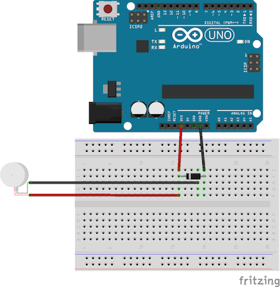
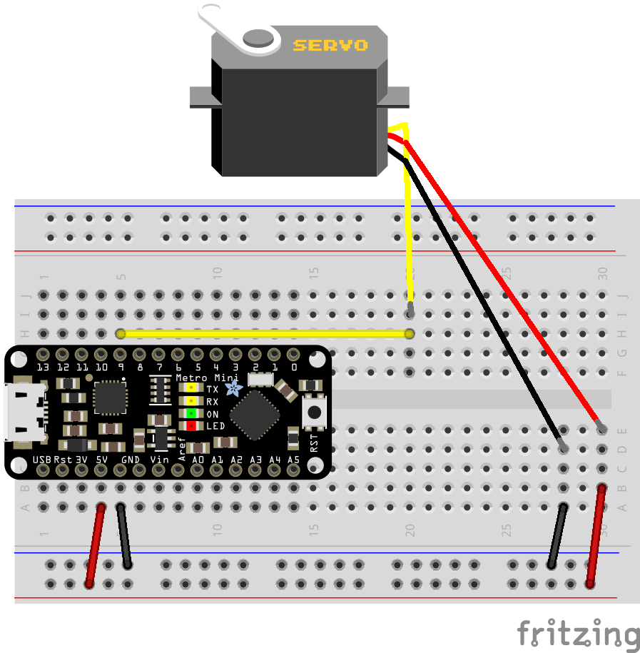
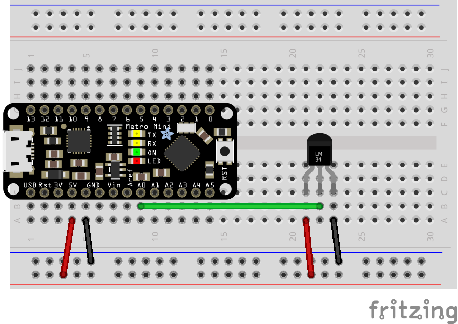
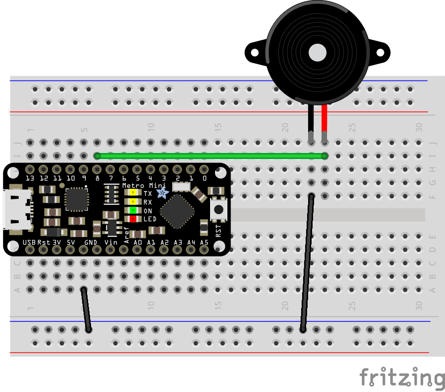

# Welcome to the Examples!

This section contains example implementations for each of the standard and special modes:

  - [Basics](#basics)  
  - [LEDs](#leds)  
  - [RGB LEDs](#rgb-leds)  
  - [Motor & Servo](#motor--servo)  
  - [Button](#button)  
  - [Variable Resistors](#variable-resistors)  
  - [Temperature](#temperature)  
  - [Piezo: Tone & Knock](#piezo-tone--knock)  
  - [Serial](#serial)  

Script files for each of these examples are available in [`example_scripts`](example_scripts). You can determine which is run by editing [this line](index.html#L13) to point to the script you want to run:

```html
   <!-- Swap out the script below with any of the others in example_scripts. -->
   <script src="/example_scripts/01_basics/03_ButtonDraw.js"></script>
```

Or peruse the examples below and morph them to make your own!

### Finding Your Port

The examples may fail if your port has a different name than the default port: `COM3`. On windows, you can find the communications port by using the Device Manager.

Common ports include:

```js
/dev/cu.usbmodem1411 // MacBook Air, right side; MacBook, left side
/dev/cu.usbmodem1451 // MacBook, right side
```

If your computer is not on this list — or if these fail — you can find your port by opening the Arduino IDE and finding the port under `Tools > Port` or by running the following in the cmd terminal with the Arduino plugged in:

```
 mode
```

## Examples

### Basics

#### Digital Read
  
_diagram: simple_button_

```js
// Board setup — you may need to change the port
var b = p5.board('COM3', 'arduino');

// Test digital read
var p = b.pin(9, 'DIGITAL', 'INPUT');
p.read(function(val){console.log(val);});

function setup() {

  var innerStr = '<p style="font-family:Arial;font-size:12px">';
  innerStr += 'Check out the console for readings</p>';

  createDiv(innerStr);
}
```


#### Analog Read
  
_diagram: potentiometer_

```js
// Board setup — you may need to change the port
var b = p5.board('COM3', 'arduino');

// Test analog read
var p = b.pin(0, 'ANALOG', 'INPUT');
p.read(function(val){console.log(val);});

function setup() {
  createCanvas(300, 200);

  var innerStr = '<p style="font-family:Arial;font-size:12px">';
  innerStr += 'Check out the console for readings</p>';

  createDiv(innerStr);
}
```


#### Button Draw
  
_diagram: simple_button_

```js
// Board setup — you may need to change the port
var b = p5.board('COM3', 'arduino');

// Draw ellipses with a button

var p;

function setup() {
  p = b.pin(9, 'DIGITAL', 'INPUT');
  p.read();

  createCanvas(1200, 300);
  noStroke();

  var innerStr = '<p style="font-family:Arial;font-size:12px">';
  innerStr += 'Press the button</p>';

  createDiv(innerStr);
}

function draw() {
  if (p.val) {
    fill(Math.random() * 255, Math.random() * 255, Math.random() * 255);
    ellipse(Math.random() * width, Math.random() * height, 60, 60);
  }
}
```


#### Light LED (Digital Write)
  
_diagram: led_

```js
// Board setup — you may need to change the port
var b = p5.board('COM3', 'arduino');

// Click the circle to light the LED
 
var pin;

function setup() {
  createCanvas(400, 400);
  noStroke();
  fill(62, 0, 255);
  ellipse(width/2, height/2, 100, 100);
  pin = b.pin(9, 'DIGITAL', 'OUTPUT');
}

function mousePressed() {
  var d = dist(width/2, height/2, mouseX, mouseY);
  if (d < 100) {
    pin.write('HIGH');
  }
}

function mouseReleased() {
  pin.write('LOW');
}
```

Alternately, integrated with p5.DOM element.

```js
// Board setup — you may need to change the port
var b = p5.board('COM3', 'arduino');

// Click a button to light the LED

function setup() {
  createCanvas(400, 400);
  var pin = b.pin(9, 'DIGITAL', 'OUTPUT');

  
  var button = createButton('LIGHT THE LED!!');
  button.position(width/2, height/2);
  button.mousePressed(function(){
    pin.write('HIGH');
  });

  button.mouseReleased(function(){
    pin.write('LOW');
  });
}
```


#### PWM Slider (PWM)
  
_diagram: led_

```js
// Board setup — you may need to change the port
var b = p5.board('COM3', 'arduino');

// PWM Slider

var slider, pin;

function setup() {
  slider = createSlider(0, 255, 150);
  slider.position = (10, 10);
  pin = b.pin(9, 'PWM', 'OUTPUT');

}

function draw() {
  var val = slider.value();
  pin.write(val);
}
```

### LEDs
#### LED Blink
  
_diagram: led_

```js
// Board setup — you may need to change the port
var b = p5.board('COM3', 'arduino');

// Blink LED 
var led;

function setup() {
  led = b.pin(9, 'LED');

  createCanvas(300, 200);

  var innerStr = '<p style="font-family:Arial;font-size:12px">';
  innerStr += '<b>&larr;</b> LED on &nbsp; | &nbsp;';
  innerStr += '<b>&rarr;</b> LED off &nbsp; | &nbsp;';
  innerStr += '<b>&uarr;</b> Blink LED &nbsp; | &nbsp;';
  innerStr += '<b>&darr;</b> Stop Blinking </p>';

  createDiv(innerStr);
}

function keyPressed() {
  if (keyCode === LEFT_ARROW){
    led.on();
  } else if (keyCode === RIGHT_ARROW) {
    led.off();
  } else if (keyCode === UP_ARROW){
    led.blink();
  } else if (keyCode === DOWN_ARROW) {
    led.noBlink();
  }
}
```

#### LED Fade 
  
_diagram: led_

```js
// Board setup — you may need to change the port
var b = p5.board('COM3', 'arduino');

// Fade LED 

var led;

function setup() {
  led = b.pin(9, 'LED');

  createCanvas(300, 200);

  var innerStr = '<p style="font-family:Arial;font-size:12px">';
  innerStr += '<b>&darr;</b> Fade </p>';

  createDiv(innerStr);
}

function keyPressed(){
 if (keyCode === DOWN_ARROW) {
  led.write(200);
  led.fade(200, 0);
 } 
}
```


### RGB LEDs
#### RGB Write
  
_diagram: rgb_

```js
// Board setup — you may need to change the port
var b = p5.board('COM3', 'arduino');

function setup() {
  var rgb = b.pin({r: 9, g: 10, b: 11}, 'RGBLED');
  var c = color(65);
  rgb.write(c);
  fill(c);
  noStroke();
  ellipse(80, 80, 40, 40);
}
```

#### RGB Read
  
_diagram: rgb_

```js
// Board setup — you may need to change the port
var b = p5.board('COM3', 'arduino');

var rgb, c;

function setup() {

  createCanvas(300, 200);

  var innerStr = '<p style="font-family:Arial;font-size:12px">';
  innerStr += 'Press any key & check out the console for readings</p>';

  createDiv(innerStr);


  rgb = b.pin({r: 9, g: 10, b: 11}, 'RGBLED');
  c = color(Math.floor(Math.random() * 255), Math.floor(Math.random() * 255), Math.floor(Math.random() * 255));
  rgb.write(c);
  fill(c);
  noStroke();
  ellipse(80, 80, 40, 40);
}

// On any key press logs the color to the console
function keyPressed(){
  rgb.read(function(val){ console.log(val.toString()); });
}
```

#### Blink RGB
  
_diagram: rgb_

```js
// Board setup — you may need to change the port
var b = p5.board('COM3', 'arduino');

// RGB LED On/Off/Blink
var rgb, c;

function setup() {

  createCanvas(300, 200);

  var innerStr = '<p style="font-family:Arial;font-size:12px">';
  innerStr += '<b>&larr;</b> LED on &nbsp; | &nbsp;';
  innerStr += '<b>&rarr;</b> LED off &nbsp; | &nbsp;';
  innerStr += '<b>&uarr;</b> Blink LED &nbsp; | &nbsp;';
  innerStr += '<b>&darr;</b> Stop Blinking </p>';

  createDiv(innerStr);

  rgb = b.pin({r: 9, g: 10, b: 11}, b.RGBLED);
  c = color(Math.floor(Math.random() * 255), Math.floor(Math.random() * 255), Math.floor(Math.random() * 255));
  rgb.write(c);
  fill(c);
  noStroke();
  ellipse(150, 100, 40, 40);
}

function keyPressed() {
  if (keyCode === LEFT_ARROW){
    rgb.on();
  } else if (keyCode === RIGHT_ARROW) {
    rgb.off();
  } else if (keyCode === UP_ARROW){
    rgb.blink();
  } else if (keyCode === DOWN_ARROW) {
    rgb.noBlink();
  }
}
```

#### Fade RGB
  
_diagram: rgb_

```js
// Board setup — you may need to change the port
var b = p5.board('COM3', 'arduino');

// Fade RGB
var rgb;

function setup() {

  createCanvas(300, 200);

  var innerStr = '<p style="font-family:Arial;font-size:12px">';
  innerStr += '<b>&darr;</b> Fade </p>';

  createDiv(innerStr);

  rgb = b.pin({r: 9, g: 10, b: 11}, 'RGBLED');
  var c = color(Math.floor(Math.random() * 255), Math.floor(Math.random() * 255), Math.floor(Math.random() * 255));
  rgb.write(c);
  fill(c);
  noStroke();
  ellipse(80, 80, 40, 40);
}

function keyPressed(){
 if (keyCode === DOWN_ARROW) {
  rgb.write([200, 200, 200]);
  rgb.fade([200, 0, 3000], [200, 0, 5000, 50], [200, 0, 1000, 50]);
 } 
}
```

### Motor & Servo
#### Motor
  
_diagram: motor_

```js
// Board setup — you may need to change the port
var b = p5.board('COM3', 'arduino');

// Test motor functionality
var motor;

function setup() {
  motor = b.pin(9, 'MOTOR');

  createCanvas(300, 200);

  var innerStr = '<p style="font-family:Arial;font-size:12px">';
  innerStr += '<b>&larr;</b> Motor on &nbsp; | &nbsp;';
  innerStr += '<b>&rarr;</b> Motor off &nbsp; | &nbsp;';
  innerStr += '<b>&uarr;</b> motor.write(100) </p>';

  createDiv(innerStr);
}

function keyPressed() {
  if (keyCode === LEFT_ARROW){
    motor.on();
  } else if (keyCode === RIGHT_ARROW) {
    motor.off();
  } else if (keyCode === UP_ARROW){
    motor.write(100);
  }
}
```

#### Servo
  
_diagram: servo_

```js
// Board setup — you may need to change the port
var b = p5.board('COM3', 'arduino');

// Test servo functionality
var servo;

function setup() {
  createCanvas(300, 200);

  var innerStr = '<p style="font-family:Arial;font-size:12px">';
  innerStr += '<b>&larr;</b> To 15 &nbsp; | &nbsp;';
  innerStr += '<b>&rarr;</b> To 45 &nbsp; | &nbsp;';
  innerStr += '<b>&uarr;</b> Sweep &nbsp; | &nbsp;';
  innerStr += '<b>&darr;</b> Stop Sweeping </p>';

  createDiv(innerStr);

  servo = b.pin(9, 'SERVO');
  servo.range([0, 60]);
}

function keyPressed() {
   if (keyCode === LEFT_ARROW) {
     console.log('l')
     servo.write(15);
   } else if (keyCode === RIGHT_ARROW) {
     console.log('r')
     servo.write(45);
   } else if (keyCode === UP_ARROW) {
     console.log('u')
     servo.sweep();
   } else if (keyCode === DOWN_ARROW) {
     console.log('d')
     servo.noSweep();
   } 
}
```

### Button
#### Button
  
_diagram: simple_button_

```js
// Board setup — you may need to change the port
var b = p5.board('COM3', 'arduino');

// Test Pressed, Held, Released
var button;

function setup() {
  createCanvas(600, 200);

  var innerStr = '<p style="font-family:Arial;font-size:12px">';
  innerStr += 'Press for Red &nbsp; | &nbsp;';
  innerStr += 'Release for Blue &nbsp; | &nbsp;';
  innerStr += 'Hold for Green </p>';

  createDiv(innerStr);

  
  button = b.pin(9, 'BUTTON');

  function redEllipse() {
    console.log('pressed');
    clear();
    noStroke();
    fill(255, 0, 0);
    ellipse(100, 100, 40, 40);
  }

  function blueEllipse() {
    console.log('released');
    clear();
    noStroke();
    fill(0, 0, 255);
    ellipse(200, 100, 40, 40);
  }

  function greenEllipse() {
    console.log('held')
    clear();
    noStroke();
    fill(0, 255, 136);
    ellipse(300, 100, 40, 40);
  }
  
  button.read();
  button.pressed(redEllipse);
  button.released(blueEllipse);
  button.held(greenEllipse, 1000);

}
```

### Variable Resistors
#### Variable Resistors
  
_diagram: potentiometer_

```js
// Board setup — you may need to change the port
var b = p5.board('COM3', 'arduino');

// Test Read & Threshold
var pmeter;

function setup() {
  createCanvas(300, 200);

  var innerStr = '<p style="font-family:Arial;font-size:12px">';
  innerStr += 'Check out the console for readings &nbsp; | &nbsp;';
  innerStr += 'Press any key to test threshold </p>';

  createDiv(innerStr);


  pmeter = b.pin(0, 'VRES');
  pmeter.read(function(val){ console.log('pmeter read', val)});
  pmeter.range([10, 400]);
  pmeter.threshold(600);
}

function keyPressed() {
  console.log('is over?', pmeter.val, pmeter.overThreshold());
}
```

### Temperature
#### Temperature
  
_diagram: temp_

This example uses a [TS-195 analog temperature sensor](http://tinkersphere.com/sensors/195-temperature-sensor-arduino-compatible.html) but should work with all analog temp sensors.

```js
// Board setup — you may need to change the port
var b = p5.board('COM3', 'arduino');

// Test all read modes
var thermo;

function setup() {
  createCanvas(300, 200);

  var innerStr = '<p style="font-family:Arial;font-size:12px">';
  innerStr += '<b>&larr;</b> Write F to console &nbsp; | &nbsp;';
  innerStr += '<b>&rarr;</b> Write C to console &nbsp; | &nbsp;';
  innerStr += '<b>&uarr;</b> Write raw value to console &nbsp; | &nbsp;';
  innerStr += '<b>&darr;</b> Write K to console </p>';

  createDiv(innerStr);


  thermo = b.pin({ pin: 0, voltsIn: 5 }, 'TEMP');
  thermo.read();
}

function keyPressed() {
  if (keyCode === LEFT_ARROW) {
    console.log('f');
    console.log(thermo.F);
  } else if (keyCode === RIGHT_ARROW) {
    console.log('c');
    console.log(thermo.C);
  } else if (keyCode === UP_ARROW) {
    console.log('v');
    console.log(thermo.val);
  } else if (keyCode === DOWN_ARROW) {
    console.log('k')
    console.log(thermo.K);
  }
}
```

### Piezo: Tone & Knock
#### Tone
  
_diagram: tone_

```js
// Board setup — you may need to change the port
var b = p5.board('COM3', 'arduino');

// Play tones
var t;

function setup() {
  createCanvas(300, 200);

  var innerStr = '<p style="font-family:Arial;font-size:12px">';
  innerStr += '<b>&larr;</b> Write note &nbsp; | &nbsp;';
  innerStr += '<b>&rarr;</b> Write frequency &nbsp; | &nbsp;';
  innerStr += '<b>&uarr;</b> Does nothing! &nbsp; | &nbsp;';
  innerStr += '<b>&darr;</b> No Tone </p>';

  createDiv(innerStr);


  t = b.pin(8, 'TONE'); // Can also set mode to 'PIEZO'
}

function keyPressed() {
  if (keyCode === LEFT_ARROW) {
    console.log('note');
    t.tone('e7', 10000)
  } else if (keyCode === RIGHT_ARROW) {
    console.log('freq');
    t.tone(600, 400);
  } else if (keyCode === UP_ARROW) {
    console.log('up does nothing!!');
    console.log(t);
  } else if (keyCode === DOWN_ARROW) {
    console.log('nT')
    t.noTone();
  }
}
```

#### Knock
  
_diagram: knock_

```js
// Board setup — you may need to change the port
var b = p5.board('COM3', 'arduino');

// Get ready to knock
var k;

function setup() {

 createCanvas(300, 200);

 var innerStr = '<p style="font-family:Arial;font-size:12px">';
 innerStr += 'Check out log to see values</p>';

 createDiv(innerStr);

 k = b.pin(0, 'KNOCK'); // Can also set mode to 'PIEZO'
 k.threshold(200);
 k.read();
}

function draw() {
  console.log('Value:', k.val, 
              'threshold:', k.threshold, 
              'overThreshold?:', k.overThreshold());
}
```

### Serial
#### Serial 
_no diagram, will return ambient values_

```js
var serial;

function setup() {
  serial = p5.serial();
  serial.list();

  serial.connect('COM3');

  // Open console to read values
  serial.read(function(data){ console.log(data); })
}
```
